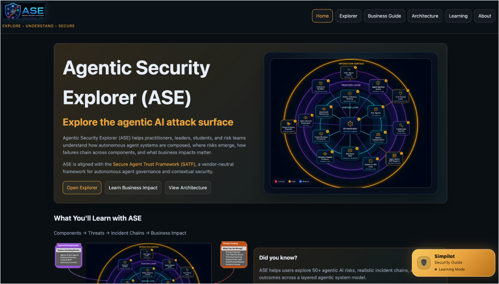
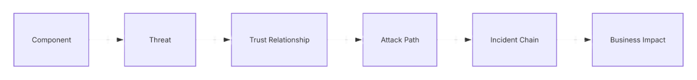
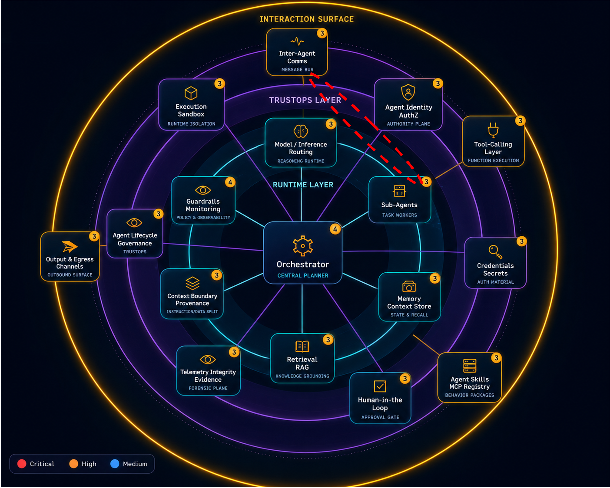
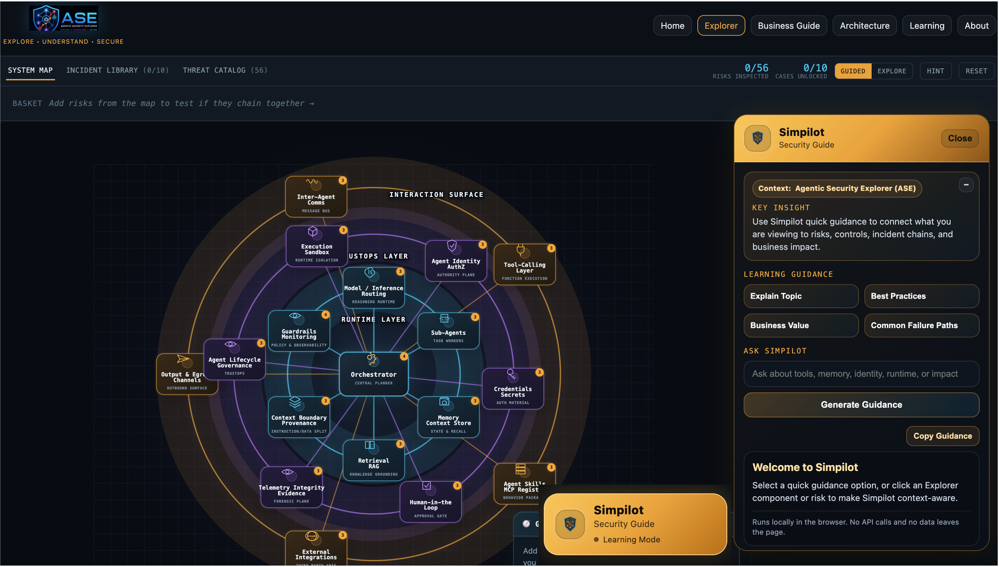

import { SITE } from "@/config";
import Callout from '@/components/Callout.astro';
import ArchitectureNote from '@/components/ArchitectureNote.astro';
import ArchitectureNote2 from '@/components/ArchitectureNote2.astro';
import exampleImage from "@/assets/images/posts/satf/satf-baseline-1-framework.png";
import ResponsiveTable from '@/components/ResponsiveTable.astro';

## Agentic Security Explorer (ASE)- A Gamified and Interactive way to explore Agentic Attack Surface

<Callout type="intro" title="Why Agentic Security Explorer (ASE) Was Created">

As agentic AI systems become increasingly autonomous, interconnected, and capable of taking action on behalf of users and organizations, understanding security can no longer rely solely on static diagrams, spreadsheets, or traditional threat catalogs.

ASE was created to make complex agentic security understandable through exploration, visualization, and guided learning.
</Callout>

---
## The Problem: Agentic Systems Are Becoming Too Complex to Explain

Traditional applications generally follow predictable patterns.
<Callout type="intro" title="">
- Users interact with software. =>

- Software executes logic. =>

- Security teams identify assets, trust boundaries, and attack paths. =>
</Callout>
Agentic systems introduce a very different reality.

### Modern architectures increasingly include:

- Agent Planners
- Agent Orchestrators
- Memory Systems
- Retrieval and RAG Pipelines

- Tool and MCP Integrations
- Agent Identity Services
- Runtime Monitoring
- Human Approval Workflows
- Multi-Agent Collaboration

Each component introduces its own risks.

More importantly, each component introduces new trust relationships.
<Callout type="warning" title="">
Many teams can identify individual threats such as prompt injection, privilege escalation, or memory poisoning. The far greater challenge is understanding how these weaknesses interact across an interconnected agent ecosystem.
</Callout>
---

## The Hidden Complexity of Agentic Architectures

A modern agent ecosystem may include:

<ArchitectureNote2 type="info">
User

  ↓

Agent

  ↓

Planner

  ↓

Memory

  ↓

Tools

  ↓

Enterprise Systems
</ArchitectureNote2>

Now add:

<ArchitectureNote type="warning">
    - Multi-Agent Collaboration

    - Runtime Governance

    - Delegated Authority

    - External MCP Services

    - Human Approvals
</ArchitectureNote>

The result is a rapidly expanding attack surface.

<ArchitectureNote2
  type="insight2"
  title="A Shift in Thinking"
>
 - Traditional systems are often secured by protecting assets.

 - Agentic systems increasingly require securing relationships.

    -> Users trust agents.

    -> Agents trust tools.

    -> Tools trust identities.

    -> Agents trust memory.

    -> Humans trust recommendations.

  - Many agentic security failures emerge not from a single compromised component, but from the breakdown of trust across these relationships.
</ArchitectureNote2>

<ArchitectureNote
  type="info"
  title="Why This Matters"
>
 - Security teams can often identify individual risks.

 - The challenge is understanding how multiple weaknesses interact across an agent ecosystem to create significant operational, financial, compliance, and reputational impact.
</ArchitectureNote>

---

## Why Traditional Threat Modeling Starts to Break Down

Traditional threat modeling remains essential and continues to provide a strong foundation.

Organizations commonly leverage:

- STRIDE
- Attack Trees
- MITRE ATT&CK
- Kill Chains
- Data Flow Threat Modeling

These techniques are effective at identifying individual weaknesses and attack paths.

However, agentic systems introduce characteristics that traditional systems rarely possessed:

- Dynamic workflows
- Autonomous actions
- Long-lived memory
- Tool execution

- Context inheritance
- Multi-agent collaboration
- Emergent behavior

As a result, attacks rarely remain isolated.

Consider:
<ArchitectureNote2 type="info">
Prompt Injection

       ↓

Retrieved Context Poisoned

       ↓

Memory Corrupted

       ↓

Planning Impacted

       ↓

Unsafe Tool Action

       ↓

Business Consequences
</ArchitectureNote2>

The challenge is no longer understanding a single threat.

The challenge is understanding the chain.

---

## From Components to Consequences

ASE was designed around a simple observation:

Security teams rarely struggle to understand individual threats.

The challenge is understanding how those threats propagate across interconnected systems.

ASE helps users navigate this journey visually rather than through isolated lists, spreadsheets, diagrams, and disconnected documentation.

---

## Recent Incidents Demonstrate the Challenge

Over the past several years, researchers and practitioners have demonstrated attacks involving:

- Prompt Injection
- Retrieval Poisoning
- Tool Misuse
- Context Manipulation

- Memory Abuse
- Excessive Agent Permissions
- Autonomous Action Exploitation

What makes these incidents important is not simply the individual attack.

It is how attacks propagate across components, trust relationships, and operational workflows.

<ArchitectureNote2 type="danger">
Threat

   ↓

Component

   ↓

Trust Relationship

   ↓

Incident Chain

   ↓

Business Impact
</ArchitectureNote2>

This type of propagation is difficult to communicate using static diagrams or traditional threat catalogs.

---

## A Need for a Different Perspective

<Callout type="warning" title="Organizations increasingly need answers to simple questions:">
- What components exist within agentic architectures?
- How do those components interact?
- What threats affect each component?
- How do threats combine into attack chains?
- Which controls break the chain?
- What business impacts are possible?
</Callout>
Most importantly:

 How can all stakeholders understand agentic risk without becoming AI security experts?
<Callout type="Exe" title="">

This challenge became one of the primary motivations behind the creation of the Agentic Security Explorer (ASE).
</Callout>
---

## Introducing the Agentic Security Explorer (ASE)

<a href={SITE.aseUrl} target="_blank">The Agentic Security Explorer (ASE)</a> is an interactive learning and visualization platform designed to simplify the understanding of agentic AI security.

Rather than presenting security as isolated threats, controls, or compliance requirements, ASE visualizes the entire agentic ecosystem as an interconnected attack surface.

Users can explore:

- Agentic Components
- Security Attack Surfaces
- Threat Categoriesƒ
- Incident Chains

- Security Patterns
- Controls
- Business Impacts
- Architecture Concepts

All within a single interactive experience.

<Callout type="Sol" title="The objective is simple:">
 Transform complex agentic security concepts into an intuitive visual exploration experience.
</Callout>
---

## Learning Through Exploration

ASE was intentionally designed as a guided and gamified learning environment.

<ArchitectureNote type="success" title="Users can:">
Explore Components

        ↓

Discover Threats

        ↓

Understand Risks

        ↓

Unlock Incident Chains

        ↓

Analyze Business Impact

        ↓

Explore Controls
</ArchitectureNote>

Instead of reading static security documentation, users interact directly with the architecture and learn through exploration.

---

## A Platform for Multiple Audiences

Different stakeholders gain value from ASE in different ways.

### 🛡️ Security Practitioners
    - Threat discovery
    - Attack-path analysis
    - Control mapping
    - Incident-chain analysis

### 🎯 Security Architects
    - Trust boundary visualization
    - Component relationship mapping
    - Governance planning
    - Architecture assessment

### 👁️ Business Leaders
    - Risk understanding
    - Stakeholder communication
    - Business-impact awareness

### Students and Learners
    - Interactive learning
    - Threat-modeling education
    - Agentic architecture familiarization

<Callout type="tip" title="ASE Is Designed For More Than Security Teams">
ASE was intentionally designed to support multiple perspectives:
</Callout>

• Security Practitioners

• Security Architects

• Developers

• Risk Managers

• Governance Teams

• Business Leaders

• Students and Learners

Each audience can explore the same ecosystem while viewing it through a different lens.

---

## Connecting Technical Risks to Business Outcomes

One of ASE's most important goals is helping users understand why a threat matters.

<ArchitectureNote2 type="danger" title="ASE helps connect:">
Threat

    ↓

Component

    ↓

Incident Chain

    ↓

Control Gap

    ↓

Business Impact
</ArchitectureNote2>

This translation enables organizations to move beyond purely technical discussions and understand:

- Financial Risk
- Operational Disruption
- Regulatory Exposure
- Compliance Concerns
- Brand and Reputation Impact

<Callout type="Exe" title="Beyond Technical Risks">
The most effective security conversations occur when technical risks are translated into business outcomes.
</Callout>

---

## Architecture Guidance and Security Patterns

ASE does not stop at discussing threats.
<Callout type="Sol" title="It also helps users explore:">
    - Security Patterns
    - Runtime Controls
    - Governance Approaches
    - Trust Boundaries
    - Architectural Considerations
</Callout>

<ArchitectureNote type="info" title="Examples include:">

- How should memory be secured?
- Where should governance controls exist?
- How should tool invocation be managed?
- Which runtime controls matter most?
- How can attack chains be interrupted?
- Where should human oversight be introduced?
</ArchitectureNote>

The goal is not simply to identify what can go wrong.

The goal is to help users understand how systems can be designed more securely.

---

## Simpilot: Guided Learning for Agentic Security

As ASE evolved, it became clear that many users needed more than exploration.

They needed guidance.

Simpilot was introduced as a context-aware security guide that helps users understand:
<Callout type="Sol" title="context-aware security guide">
- Components
- Threats
- Risks
- Incident Chains
- Business Impact
- Security Controls
</Callout>
Unlike a traditional chatbot, Simpilot adapts to the user's current context and learning journey.

Depending on what is being explored,

<ArchitectureNote type="info" title="Simpilot can operate as:">
 - Learning Guide =>

 - Component Explorer =>

 - Risk Analyst =>

 - Incident Interpreter => 
</ArchitectureNote>

The objective is not merely to provide answers.

The objective is to help users develop understanding.

---

## Beyond Threat Catalogs

The future of agentic security will require more than lists of threats and controls.
<Callout type="note" title="Organizations must increasingly understand:">
- Incident Chains
- Trust Relationships
- Attack Surface Interaction
- Runtime Behavior
- Governance Decisions
- Business Outcomes
</Callout>

Future ASE enhancements continue to explore these areas through:
    <Callout type="Exe" title="">
    - Expanded Incident Libraries
    - Adaptive Learning Experiences
    - Attack Surface Exploration
    - Trust-Based Security Analysis
    - Trust Collapse Indicator (TCI) Research
    </Callout>
The goal remains unchanged:

 Make complex agentic security understandable.

---

## Looking Ahead

Agentic systems continue to evolve rapidly.

As systems become:

- More autonomous
- More interconnected
- More capable of acting independently

security teams must develop new ways to understand not only threats, but also relationships, dependencies, and trust assumptions.

Visualization and guided exploration will become increasingly important.

ASE was created to support that journey.

---

## Conclusion

Agentic AI is introducing a new level of architectural complexity.

Security teams must now understand not only individual threats but also how those threats interact across memory, context, tools, identities, governance systems, and autonomous agents.

Static diagrams and traditional threat catalogs are no longer enough.

Organizations need new ways to visualize, explore, and communicate agentic risk.

<Callout type="Exe" title="The ASE">
The Agentic Security Explorer (ASE) was created to address exactly that challenge by helping security professionals, architects, business leaders, and learners understand the complete agentic attack surface through an interactive, visual, and engaging experience.
</Callout>
---

## Explore ASE

🔗 https://ase.kamaldhingra.com

---
