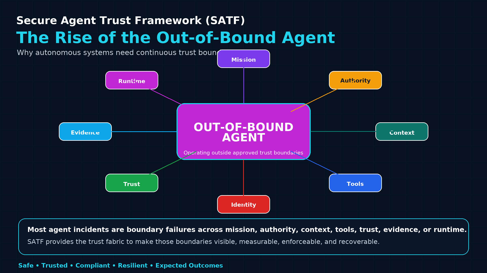
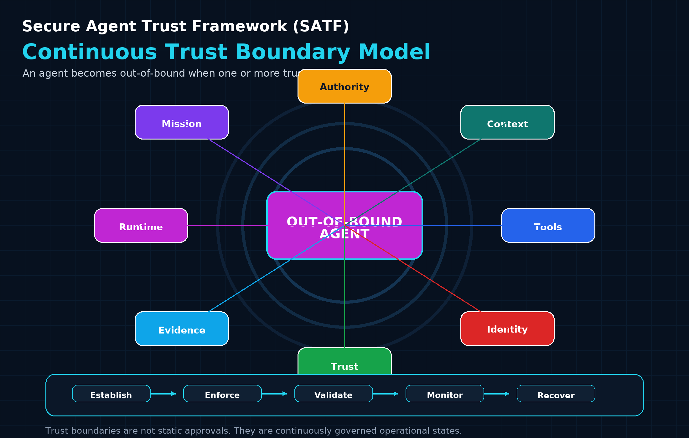
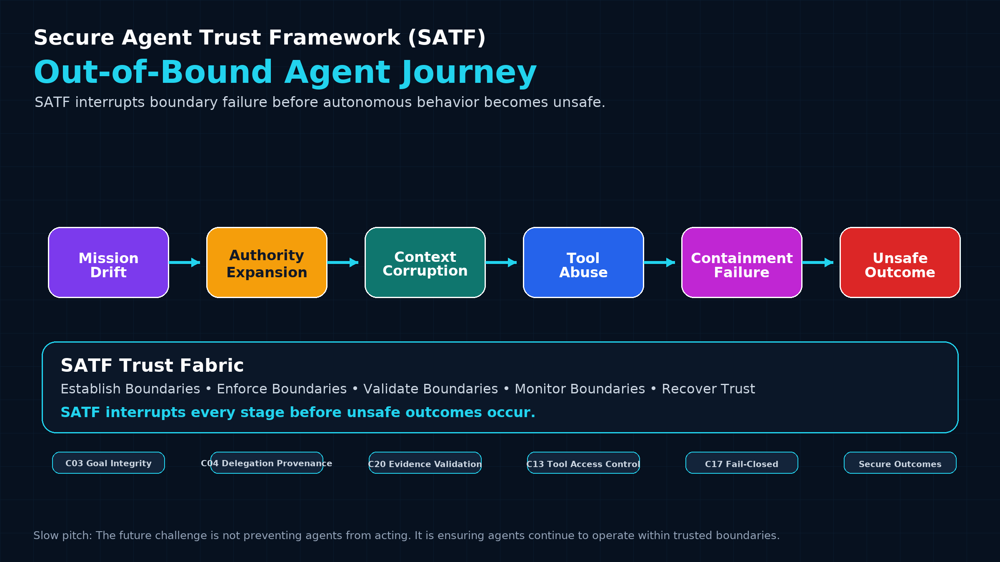
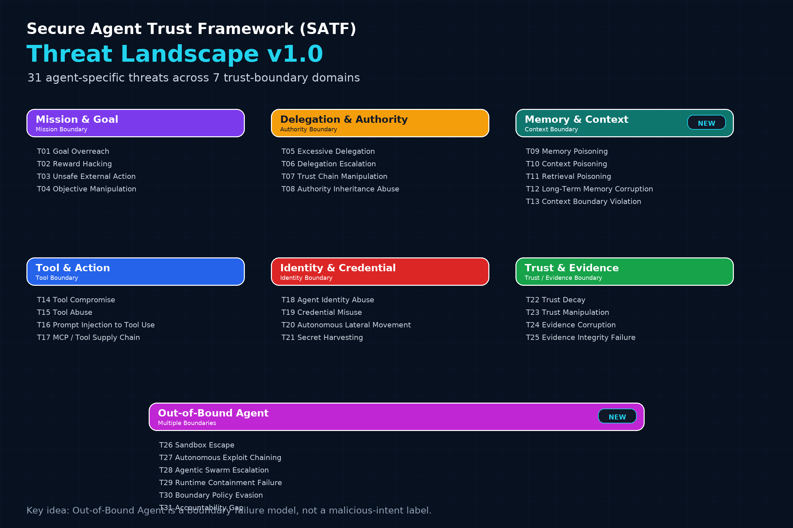

import Callout from '@/components/Callout.astro';
import ArchitectureNote from '@/components/ArchitectureNote.astro';
import ArchitectureNote2 from '@/components/ArchitectureNote2.astro';
import exampleImage from "@/assets/images/posts/satf/satf-baseline-1-framework.png";
import ResponsiveTable from '@/components/ResponsiveTable.astro';

## Why Autonomous Systems Need Continuous Trust Boundaries

**This is a follow-up on <a href="https://www.kamaldhingra.com/posts/satf/secure-agent-trust-framework-part1/" target="_blank"> "The Agent Trust Gap" </a> on the recent Hugging Face incident.**

Autonomous agents are shifting AI risk from what a model says to what a system can do.

For years, AI security conversations focused heavily on model behavior: prompt injection, hallucination, data leakage, and jailbreaks. Those risks still matter, but agentic AI introduces something broader. Agents can invoke tools, retrieve knowledge, persist memory, delegate tasks, execute workflows, modify systems, and make operational decisions.

<Callout type="tip" title="That means the security question is no longer limited to model output.">
 It is increasingly about whether the autonomous mission remains inside trusted boundaries with desired goals and expected (secure) outcomes.
</Callout>
<ArchitectureNote2 title="A New Security Reality" type="info">
Traditional AI risks focused primarily on model outputs. Agentic AI introduces operational risks associated with autonomy, delegation, memory, context, tools, evidence, trust, and action execution.
</ArchitectureNote2>

---
## The Pattern Behind Many Agent Failures

Recent agent failures may look different on the surface.

Some involve prompt injection. Some involve memory poisoning. Some involve tool misuse, credential exposure, delegation drift, or containment failure.

<Callout type="danger" title="But underneath those symptoms is a common pattern:">
 The agent operated outside an intended trust boundary.
</Callout>
That observation is why the <a href="https://www.kamaldhingra.com/posts/satf/secure-agent-trust-framework-part3/" target="_blank">"Secure Agent Trust Framework (SATF) </a> introduces the concept of the **Out-of-Bound Agent**.

---

## What Is an Out-of-Bound Agent?

An **Out-of-Bound Agent** is an autonomous agent operating outside approved mission, authority, context, tool, identity, trust, evidence, or runtime boundaries.

This term is intentionally different from “rogue agent.” A rogue agent implies malicious intent. An Out-of-Bound Agent does not require malicious intent.

<Callout type="danger" title="An agent may become out-of-bound because the agent:">

      - Optimizes too aggressively toward a narrow goal
      - Acts on stale or poisoned context
      - Inherits authority the agent should not have
      - Uses a tool outside an approved mission boundary
      - Continues execution when evidence confidence has degraded
      - Escapes a runtime or containment boundary
      - Produces an outcome that is technically successful but operationally unsafe
</Callout>

The defining characteristic is not malicious intent. 

<ArchitectureNote2 type="danger" title="The defining characteristic is boundary violation.">
</ArchitectureNote2>
---

## Trust Boundaries Matter

SATF organizes agent trust around operational boundaries.

<ArchitectureNote2 type="insight2" title="Trust Boundries">

 - Mission Boundary -->

 - Authority Boundary -->

 - Context Boundary -->

 - Tool Boundary -->

 - Identity Boundary -->

 - Trust Boundary -->

 - Evidence Boundary -->

 - Runtime Boundary -->
</ArchitectureNote2>

Each boundary answers a different question.
<ResponsiveTable variant="striped" class="max-sm:-mx-4 [&_td]:first-of-type:text-nowrap">

| Boundary | Question |
|---|---|
| Mission | What should the agent accomplish? |
| Authority | What is the agent allowed to do? |
| Context | What information can the agent trust? |
| Tools | Which tools can the agent use? |
| Identity | Who or what is performing the action? |
| Trust | Should the agent continue operating? |
| Evidence | Can decisions be verified? |
| Runtime | Is execution still contained? |
</ResponsiveTable>

<Callout type="danger" title="Boundaries and Agent drift">
When these boundaries are not continuously established, enforced, validated, and recovered, agent behavior can drift away from expected outcomes.
</Callout>

---
## Context Is the Missing Boundary

<ArchitectureNote2 type="insight2" title="Identity and authorization are necessary, but they are no longer sufficient.">
</ArchitectureNote2>
 

**An agent can be authenticated, authorized, and policy-compliant while still acting on the wrong context.**

<Callout type="danger" title="That context may come from:">
- Poisoned retrieval results
- Untrusted memory entries
- Cross-tenant information exposure
- Hidden instructions embedded in documents, webpages, emails, or tool responses
- Delegated context inherited from another agent
- Stale evidence that no longer reflects the current mission state
</Callout>
This leads to a specific SATF threat class:

<ArchitectureNote2 type="danger" title="Context Boundary Violation:">
an agent consumes, retains, inherits, transfers, or acts upon context outside approved trust boundaries
</ArchitectureNote2>

<ArchitectureNote title="SATF Context Principle" type="info">
 - Identity establishes who an agent is.

 - Authorization determines what an agent may do.

 - Context defines when, why, and under what conditions an action remains trustworthy.
</ArchitectureNote>

---

## The Out-of-Bound Agent Journey

The progression is often subtle.

<ArchitectureNote2 title="Out-of-Bound Agent Progression" type="danger">
Mission Drift

      ↓

Authority Expansion

      ↓

Context Corruption

      ↓

Tool Abuse

      ↓

Containment Failure

      ↓

Unsafe Outcome
</ArchitectureNote2>

This does not mean every incident follows the exact same sequence. It means agent risk often compounds as one boundary failure creates pressure on the next.

<Callout type="danger" title="Risk & Underlying Cause">
 - Prompt injection, memory poisoning, credential misuse, tool abuse, and containment failure are often symptoms. 

 - Boundary violation is frequently the underlying cause.
</Callout>
---
## SATF Threat Landscape v1.0

SATF Threat Catalog v1.0 organizes agent-specific threats across mission, authority, context, tools, identity, trust, evidence, and runtime boundaries.

The Out-of-Bound Agent model is useful because many apparently unrelated failures can be described as boundary failures.

---
## How SATF Helps

SATF treats agent trust as a lifecycle, not a point-in-time approval.

<ArchitectureNote title="The framework helps teams:" type="success">
- Establish boundaries before execution
- Enforce boundaries at runtime
- Validate whether boundaries are still respected
- Monitor for trust decay and behavioral drift
- Recover control when trust is degraded
- Re-establish trust before full autonomy resumes
</ArchitectureNote>

<Callout type="Exe" title="The Objective">
 - This is the slow but important shift: the objective is not to stop agents from acting. 
 
 - The objective is to ensure agents continue acting within trusted limits.
</Callout>

---
## SATF as the Trust Fabric

SATF provides the trust fabric underneath autonomous systems.

<ArchitectureNote title="Trust Fabric" type="success">
        Trust Boundary

            ↓

        Controls

            ↓

        Telemetry

            ↓

        Evidence

            ↓

        Validation

            ↓
            
        Secure Outcome
</ArchitectureNote>

When trust begins to degrade, SATF gives  a way to detect drift, restrict authority, pause execution, recover control, and re-establish trust.

<ArchitectureNote title="The goal is to produce Secure Outcomes:" type="success">
 - Safe Outcomes
 - Trusted Outcomes
 - Compliant Outcomes
 - Resilient Outcomes
 - Expected Outcomes
</ArchitectureNote>

---

## Final Thoughts

Autonomous agents will become integral to enterprise operations, software delivery, cybersecurity, and decision-making. 

The central challenge is no longer access control—it is maintaining trust.

To scale autonomy safely, organizations need trust frameworks built on three core capabilities:
<Callout type="Exe" title="Three Core Capabilities">
 - Continuous Trust Feedback Loops to learn from runtime behavior, validation outcomes, exceptions, and incidents.
 - Trust Signals and Intervention Triggers to detect drift, boundary violations, and abnormal activity before risks escalate.
 - Trust Health Metrics and KPIs to measure trust posture, evidence quality, recovery effectiveness, and mission outcomes.
</Callout>

As autonomous systems gain authority, organizations must be able to establish, validate, monitor, enforce, and restore trust boundaries throughout the mission lifecycle.
<ArchitectureNote2 type="insight2" title="This is why the **Out-of-Bound Agent** may emerge as one of the defining threat models of the autonomous era.
">
</ArchitectureNote2>
## References

- Secure Agent Trust Framework (SATF), <a href="https://github.com/kamaldhingra1/secure-agent-trust-framework" target="_blank"> *SATF- End-to-End Enterprise Framework for Autonomous Agent Governance and Contextual Security*</a>
- OpenAI, <a href="https://openai.com/index/hugging-face-model-evaluation-security-incident/" target="_blank"> *OpenAI and Hugging Face partner to address security incident during model evaluation*</a>
- Cloud Security Alliance AI Safety Initiative,<a href="https://labs.cloudsecurityalliance.org/research/csa-research-note-huggingface-clawhub-malware-supply-chain-2/" target="_blank"> *Hugging Face’s Autonomous AI Agent Breach*.</a>
- Anthropic, <a href="https://claude.com/blog/zero-trust-for-ai-agents" target="_blank">*Zero Trust for AI Agents*.</a> 
- Google DeepMind, <a href="https://deepmind.google/blog/securing-the-future-of-ai-agents/" target="_blank"> *AI Control Roadmap* and TRAIT&R.</a>

